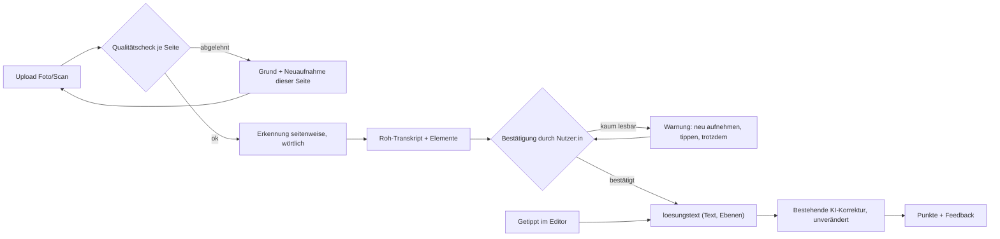

# KONZEPT · Handschrift-Upload für die KI-Klausurenkorrektur

> **Hinweis zum Stand:** Konzeptfassung vom 6.10.2026. Die Demo weicht an zwei Stellen bewusst ab: Die Gliederung bleibt wörtlich ohne Ebenen, Randnotizen stehen in einem eigenen Block (siehe ANNAHMEN.md, Nr. 14 und 15). Übersicht: README.md.

Stand 2026-10-06 · Entscheidungen E1–E6 in ENTSCHEIDUNGEN.md · Beleg zur Probe in TESTLAUF-1.md

**Kurz:** Foto oder Scan wird seitenweise wörtlich in Text umgesetzt. Die Nutzer:in bestätigt das Transkript. Erst dann geht reiner Text an die unveränderte KI-Korrektur. **Empfehlung:** zuerst einen Pilot der Erkennung samt Bestätigung messen (§7), nicht bauen.

## 1. Einschätzen und Priorisieren (freigegeben)
- **Hürde 1, technisch:** Nicht das Lesen ist das Problem, sondern das unbemerkte Falschlesen. Modelle glätten unsaubere Schrift still (Amazon, arXiv 2607.21617, bis 14 % F1-Verlust bei gestörtem Text), und Erkennungsfehler pflanzen sich in die Bewertung fort (arXiv 2506.04822). Folge: wörtliches Transkript, `[?]` bei Unsicherem, Erkennung getrennt von der Punktzahl messen.
- **Hürde 2, Qualität:** Schreibschrift, Streichungen, Einfügungen und Randnotizen verfälschen das Transkript, die Korrektur bewertet dann Fehler, die niemand schrieb. Folge: Transkript vor der Korrektur zeigen und bestätigen lassen.
- **Baustein:** Qualitätssicherung bei unsicheren Erkennungen (größtes Risiko, früh testbar, Pipeline unberührt). **Befund der Probe (4 Seiten):** Die Zahl der `[?]` hängt an der Schrift, nicht am Foto (0 bis 11 je 22 bis 30 Zeilen). Ein Foto-Qualitätscheck allein reicht nicht.

## 2. Upload-Flow und Texterkennung
- Formate JPG, PNG, HEIC, PDF, seitenweise verarbeitet (Annahme, Praxisbericht). Dateigröße Startwert 10 MB je Datei (Annahme aus Uni-Klausurenkursen, nicht verifiziert). Seitenzahl begrenzt die Pipeline (A7). Reihenfolge nach Upload, per Ziehen änderbar.
- Qualitätscheck je Seite vor der Erkennung: Schärfe, angeschnittene Zeilen, Doppelseite (wird geteilt), Fremdtext im Bild (wird zugeschnitten). Ablehnung nennt den Grund und betrifft nur diese Seite.
- Erkennung: Vision-Modell von der Stange, kein Training, Modellwahl per Test A2. Anweisung: wörtlich, `[?]` bei Unsicherem, nichts korrigieren, Elementtypen ausweisen.

## 3. Umgang mit Unsicherheit
| Element | Regel |
|---|---|
| Unleserlich | `[?]`, in der Bestätigung hervorgehoben, Lesevorschlag nur dort, nie automatisch |
| Streichung | Nicht im Korrekturtext, in der Bestätigung durchgestrichen sichtbar |
| Einfügung, Überschreibung | Einfügung an der Markierungsstelle, bei Überschreibung gilt die Endfassung. Unklar: `[?]` |
| Randnotiz | An der Verweisstelle eingesetzt, ohne Verweis ans Absatzende mit Hinweis |
| Unterstreichung | Ignoriert, in der Bestätigung als Hinweis |
| Gliederung | Ebene aus Nummerierungsmuster (A. I. 1. a)), Nummerierung bleibt im Text, unpassende Zeile erbt die Vorzeile und wird markiert |

Außerdem: Zeichnung wird `[Zeichnung]`, Silbentrennung am Zeilenende wird zusammengeführt, Fehler im Inhalt (auch falsche Paragraphen) bleiben wörtlich stehen.

**Bestätigung:** Seitenbild neben Transkript. Jede `[?]` wird ersetzt, gelöscht oder bewusst „[unleserlich]“. Erst danach geht der Text an die Korrektur. Kaum lesbare Klausur: warnen, nicht sperren (neu fotografieren, tippen, trotzdem).

## 4. Integration

| Feld | Typ | Zweck |
|---|---|---|
| `klausur.eingabetyp` | enum getippt, handschrift | Neuer Eingabetyp, nur vor der Korrektur sichtbar |
| `klausur.status` | enum hochgeladen, qualitaet_geprueft, erkannt, bestaetigung_offen, bestaetigt, korrigiert, fehler | Zustand, steuert Anzeige und Retry |
| `klausur.loesungstext` | Text mit Ebenen | **Bestehendes Feld, unverändert.** Bei Handschrift = `transkript_bestaetigt` |
| `klausur.transkript_bestaetigt` | Text mit Ebenen | Von der Nutzer:in bestätigte Fassung |
| `klausur.aenderungen` | JSON (roh → bestätigt) | Misst Erkennungsfehler aus Nutzerkorrekturen (A6) |
| `klausur.bestaetigt_am` | Zeitstempel | Nachweis der Bestätigung vor der Korrektur |
| `seite.reihenfolge` | Ganzzahl | Seitenreihenfolge |
| `seite.bild_ref` | Datei-Verweis | Original, Aufbewahrung offen (B14) |
| `seite.qualitaetsbefund` | JSON ok, gruende | Ergebnis des Vorab-Checks |
| `seite.transkript_roh` | Text | Wörtlich, mit `[?]` und Markern |
| `seite.elemente` | JSON typ, text, position, konfidenz | Grundlage der Hervorhebung in der Bestätigung |
| `seite.konfidenz` | Dezimalzahl | Lesbarkeit je Seite (A13) |

## 5. Annahmen und Tests (alle ungeprüft, Zahlen sind Schätzwerte)
| # | Annahme | Test |
|---|---|---|
| A1 | Relevanter Teil will handschriftlich üben | Kurzumfrage im Kurs, Abbrüche beim Upload zählen |
| A2 | Modell liest Juristenschrift gut genug (Startwert Wortfehler ≤ 5 %, Ziffern/§ ≤ 1 %) | 20 Seiten von 5 Schreibenden gegen Gold, getrennt nach Fachbegriff, §, Ziffer |
| A3 | Layout und Randtext verändern die Note wenig | Dieselbe Klausur mit und ohne Randtext korrigieren |
| A4 | Prüfen des Transkripts dauert ≤ 3 min | Zeitmessung mit 5 Personen |
| A5 | Handyfotos genügen mit Qualitätscheck | Ablehnquote bei 30 Testfotos |
| A6 | Transkriptionsfehler getrennt von der Punktzahl messbar | Fehler je Klausur gegen Gold und aus `aenderungen` |
| A7 | Pipeline hat keine Längen- oder Formatgrenze, die Transkripte sprengt | Nachfrage ans Team |
| A8 | Kosten und Wartezeit tragbar | Messung an 10 Klausuren |
| A9 | Korrektur liest „[unleserlich]“ nicht als Fehler | Klausur mit und ohne Marke korrigieren |
| A10 | Ebenen-Ableitung ändert die Aufbau-Bewertung nicht | Getippt gegen handschriftlich transkribiert einspeisen |
| A11 | Editor speichert Nummerierung im Überschriftstext | Beispiel-Export beim Team |
| A12 | Eine Schwelle für Warnungen existiert und hilft | Pilot, 10 Klausuren, Abbruch nach Warnung zählen |
| A13 | Modell-Konfidenz taugt zur `[?]`-Markierung | Konfidenz gegen Gold-Fehler an den A2-Seiten |

**Metriken:** M1 **Stille Fehlerrate** (Hauptmaß): Anteil der Erkennungsfehler ohne `[?]`. M2 Wortfehlerrate, getrennt nach Fachbegriff, §, Ziffer. M3 Bestätigungszeit und Anteil Klausuren ohne eine Änderung. M4 Punktedifferenz getippt gegen handschriftlich. M5 Ablehn- und Abbruchquote. Zielwerte kommen aus dem Pilot.

## 6. Offene Punkte
- **Datenschutz (B14):** Klausurfotos, Namen im Seitenkopf, Namen Dritter im Text; Aufbewahrung der Bilder klären. Der Teststack enthält Namen Minderjähriger.
- **Kosten und Laufzeit (B13):** nur über A8 zu klären.
- **Jura-Testmaterial:** Der Stack hat kein „§“, keine Gliederung, keine Randnotiz, A2 ist ohne Zusatzseiten nicht prüfbar.
- **Quellen:** arXiv 2602.00095 nennt 3,3 % (STEM, GPT-5.1), nicht „rund 4 %“. DAISY, UCL, Transkribus, Reddit und die 10-MB-Angabe sind nicht verifiziert.

## 7. Empfehlung erster Ausbauschritt
Pilot ohne Bau: 20 Seiten von 5 Schreibenden mit Gold-Transkript, darunter Jura-Seiten mit „§“, Gliederung und Randnotiz (Annahme: 5 von 20). Ein Standardmodell liest sie nach den Regeln aus §3. Gemessen werden M1, M2 und A13, parallel laufen die Rückfragen ans Team (A7, A11) und die Korrekturtests A9, A10. Der Zielwert für M1 wird **vor** dem Pilot festgelegt. Fällt M1 durch, wird der Bestätigungsschritt verstärkt, nicht ein Modell trainiert.

## 8. Muss-Bedingungen
1. Die bestehende Korrektur bleibt unverändert und erhält reinen Text.
2. Das Transkript ist wörtlich, `[?]` bei Unleserlichem, Bestätigung vor der Korrektur.
3. Jede Unbekannte hat Annahme und Test, keine erfundenen Zahlen.
