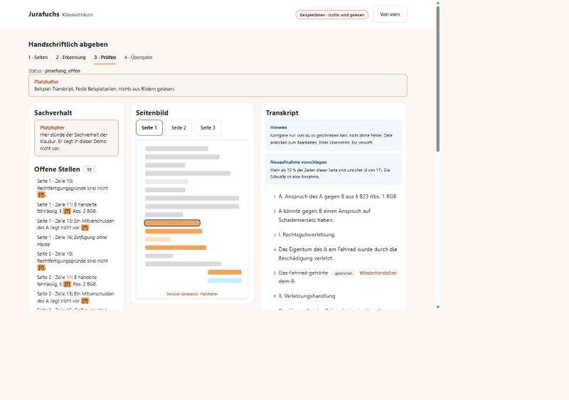
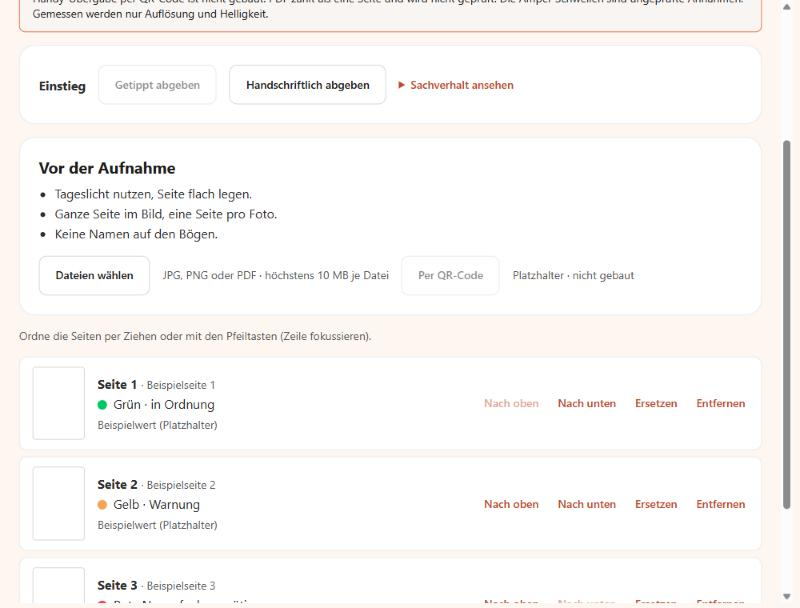
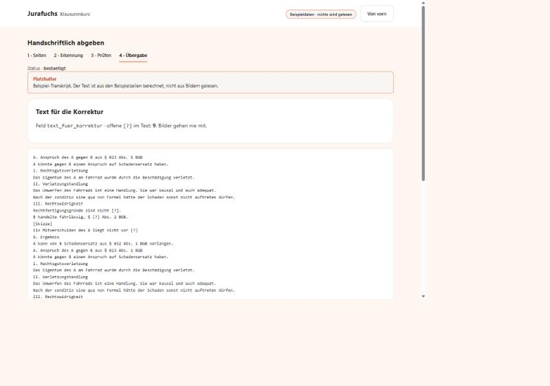

# Handschriftliche Klausuren in der KI-Korrektur (Fallstudie)

Konzept und lauffähige Demo für eine Frage aus dem Klausurenkurs: **Wie landet eine handschriftliche Klausur (Foto oder Scan) bei derselben KI-Korrektur wie eine getippte?**

Die Antwort in einem Satz: Die Seiten werden wörtlich abgeschrieben, Unsicheres wird mit `[?]` markiert, die Nutzer:in prüft und bestätigt das Transkript, und erst dann geht **reiner Text** an die unveränderte Korrektur.



## Was echt ist und was nicht

Diese Demo zeigt den Ablauf, nicht die Erkennung. **Es wird nichts aus den Bildern gelesen.**

| Bereich | Stand |
|---|---|
| Upload (JPG, PNG, PDF), Seitenübersicht, Umordnen, Ersetzen, Entfernen | echt |
| Qualitätsampel nach Auflösung und Helligkeit | echt, aber die Schwellen sind ungeprüfte Annahmen. Sie prüft nicht, ob die Schrift lesbar ist. |
| Statusfolge, Bestätigung und Übergabetext (`text_fuer_korrektur`) | echt, mit Tests |
| Prüfansicht: `[?]` auflösen, Streichung wiederherstellen, Randnotiz mitnehmen, Einfügung einsetzen, Änderungsprotokoll | echt |
| **Texterkennung** | **Platzhalter.** Feste Beispielzeilen, sichtbar gekennzeichnet, alles im Browser. Das Modul ruft kein Modell auf. Im Server liegt ein Modellaufruf, den nur die erste Iteration nutzt. Er ist ungetestet. |
| Anschluss an die Korrektur | nicht gebaut. „Als eingereicht markieren“ sendet nichts. |
| Sachverhalt, Handy-Übergabe per QR-Code, Speicherung | Platzhalter oder nicht gebaut |

Eine vollständige Liste offener Punkte steht in [OFFENE-ENTSCHEIDUNGEN.md](OFFENE-ENTSCHEIDUNGEN.md).

## Starten

Voraussetzung: Python 3.12, sonst nichts. Es gibt keine Abhängigkeiten und keinen Build.

```bash
py demo-app/server.py
```

Unter Linux oder macOS `python3 demo-app/server.py`. Danach http://localhost:4173/modul/ öffnen. Der Port lässt sich mit der Umgebungsvariable `PORT` ändern. Ohne eigene Bilder hilft der Knopf **Beispielseiten laden**. Eigene JPG-, PNG- oder PDF-Dateien gehen auch.

Getestet wurde unter Windows 11 mit Python 3.12 in einem Chromium-Browser. Andere Browser und Systeme sind nicht geprüft.

## Der Ablauf

1. **Seiten.** Fotos oder Scans hochladen, Reihenfolge ordnen, Ampel ansehen. Rot blockiert die Bestätigung, Gelb nicht.
2. **Erkennung.** Jede Seite wird einzeln gelesen. Der Leser ist an genau einer Stelle austauschbar (`LESER` in `leser.js`).
3. **Prüfen.** Links der Sachverhalt mit Übersicht, in der Mitte das Seitenbild, rechts das Transkript. Unsichere Stellen sind gelb und bearbeitbar. Bestätigt wird erst nach einer ausdrücklichen Rückfrage, wenn `[?]` stehen bleiben.
4. **Übergabe.** Gezeigt wird genau der Text, der an die Korrektur ginge, mit der Zahl offener `[?]`.

| Seiten | Prüfen | Übergabe |
|---|---|---|
|  |  |  |

Die Bilder zeigen die Beispielseiten (graue Balken), keine echten Handschriften. Der Text in der Übergabe wiederholt sich, weil der Platzhalter-Leser jeder Seite dieselben Beispielzeilen liefert.

## Drei Regeln, die nicht verhandelbar sind

1. **Die Korrektur bekommt nur Text.** Keine Bilder, kein Umbau. Das Feld `text_fuer_korrektur` ist ihr einziger Input.
2. **Das Transkript ist wörtlich.** Fehler, Rechtschreibung und Paragraphenangaben der Klausur bleiben stehen, denn genau sie sollen bewertet werden. Unleserliches wird `[?]`. Das System schreibt nie selbst einen Vorschlag in den Text. Ohne Bestätigung der Nutzer:in geht nichts weiter.
3. **Keine erfundenen Zahlen oder Fähigkeiten.** Platzhalter sind in der Oberfläche als Platzhalter markiert. Schätzwerte stehen als Annahme mit einem Test im Register.

Hinter Regel 2 steht das Hauptrisiko des Ansatzes: Nicht das Lesen scheitert, sondern das unbemerkte Falschlesen. Sprachmodelle neigen dazu, unsaubere Schrift in eine plausiblere Form zu glätten. Deshalb gibt es den Bestätigungsschritt, und die stille Fehlerrate (Fehler im Rohtranskript ohne `[?]`) ist als Hauptmaß vorgesehen.

## Tests

| Was | Wie | Umfang |
|---|---|---|
| Logik: Status, Übergabetext, Leser, Ampel | `/modul/tests.html` im Browser, ohne Installation | 29 Tests |
| Server: Status, Platzhalter, Auslieferung, Pfadtricks | `py -m unittest discover -s demo-app/tests -v` | 11 Tests |

Die Browser-Tests habe ich gegengeprüft: Zwei absichtlich eingebaute Fehler (Randnotiz ohne Haken, falsche Schwelle) wurden von vier Tests bemerkt. Ein Workflow für GitHub Actions führt die Python-Tests aus ([.github/workflows/test.yml](.github/workflows/test.yml)). Er ist angelegt, die Browser-Tests laufen dort nicht.

**Nicht getestet:** Erkennungsqualität (es gibt keine), echte Handyfotos, andere Browser, ein echter Screenreader, Kosten und Laufzeit. Der Modellaufruf im Server ist ungetestet.

## Dokumente

| Datei | Inhalt | Stand |
|---|---|---|
| [KONZEPT.md](KONZEPT.md) | Einschätzung, Konzept, Datenmodell, Annahmen, Empfehlung | Grundlage. Die Demo weicht bewusst an zwei Stellen ab (siehe unten). |
| [ENTSCHEIDUNGEN.md](ENTSCHEIDUNGEN.md) | Protokoll der getroffenen Entscheidungen | E2 und E3 sind teilweise überholt |
| [ANNAHMEN.md](ANNAHMEN.md) | Rund 90 nummerierte Annahmen der Umsetzung, mit Begründung | aktuell |
| [OFFENE-ENTSCHEIDUNGEN.md](OFFENE-ENTSCHEIDUNGEN.md) | Was noch entschieden werden muss | aktuell |
| [TEST.md](TEST.md) | Abnahme des **Konzeptpapiers** gegen die Kriterien K1 bis K6 | kein Test der App |
| [TESTLAUF-1.md](TESTLAUF-1.md) | Erster Test mit vier Handschriftseiten, Befunde und Quellenprüfung | Transkripte entfernt |
| [DESIGN.md](DESIGN.md) | Jurafuchs Design System als Umsetzungsanleitung | siehe Hinweis unten |

Die zwei Abweichungen zwischen Konzept und Demo: Die Gliederung bleibt **wörtlich ohne Markdown-Ebenen** (das Konzept wollte Ebenen aus der Nummerierung ableiten), und Randnotizen stehen in einem **eigenen Block** statt an der Verweisstelle. Beides war eine spätere Vorgabe, die Gründe stehen in `ANNAHMEN.md` (Nr. 14 und 15).

## Aufbau

```
demo-app/
  server.py            Server (Python-Standardbibliothek), liefert die Oberfläche aus
  tests/               Server-Tests
  public/modul/        das Modul: Oberfläche, Modell, Leser, Ampel, Tests, Design-Dateien
  public/index.html    erste Iteration der Demo, nicht mehr gepflegt
docs/screenshots/      Bilder für dieses README
```

Im Modul trennen die Dateien Zuständigkeiten: `modell.js` (Status und Übergabetext), `leser.js` (Leser-Schnittstelle), `ampel.js` (Qualitätsbewertung), `modul.js` (Oberfläche), `tokens.css`, `base.css`, `components.css` (Design System) und `modul.css` (Layout, nur aus Tokens).

## Daten und Datenschutz

- Die Testseiten (fremde Handschriften, darunter Kindertexte) sind **nicht** im Repository. Auch ihre Transkripte nicht. Der Ordner `demo-app/public/testdaten/` ist ausgeschlossen.
- Im echten Betrieb gingen Klausurfotos an einen Modellanbieter. Aufbewahrung, Löschung und Auftragsverarbeitung sind **nicht geklärt** (siehe offene Entscheidungen).

## Hinweise

- **Design:** Die Oberfläche folgt einem Jurafuchs Design System, das mit Claude aus öffentlich zugänglichen Informationen erstellt wurde. Das ist keine offizielle Vorgabe von Jurafuchs. Wortmarke, Maskottchen und Hausschrift sind nicht enthalten und nicht nachgebaut.
- **Entstehung:** Konzept und Code sind im Dialog mit Claude (Anthropic, Claude Code) entstanden. Entscheidungen und Annahmen sind in `ENTSCHEIDUNGEN.md` und `ANNAHMEN.md` festgehalten.
- **Lizenz:** Es ist keine Lizenz festgelegt.
- **Kontakt:** [github.com/skuba-dev](https://github.com/skuba-dev)
